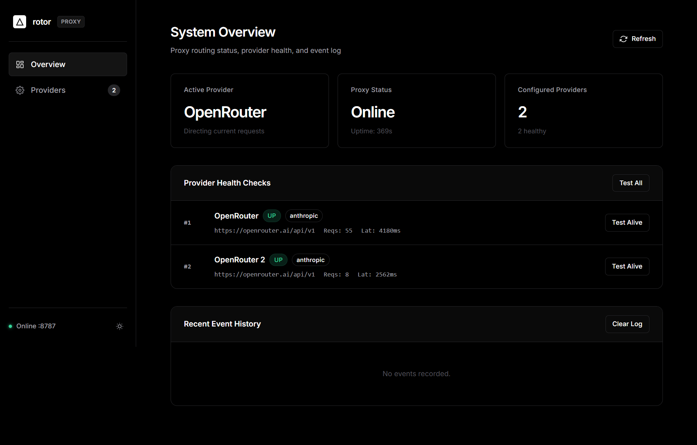
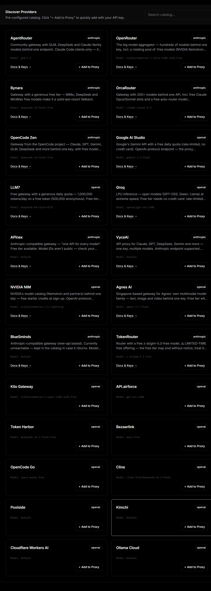
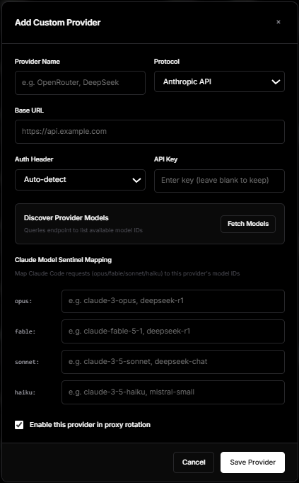
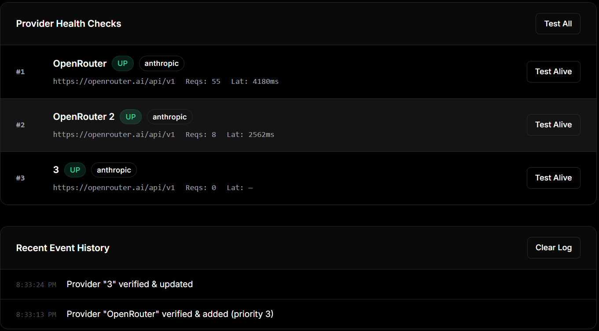

# Rotor

> Local proxy that routes Claude Code traffic across multiple LLM providers with automatic failover.

Rotor sits between Claude Code and your LLM providers at `127.0.0.1:8787`. When a provider returns an error, rate-limit, or timeout, it instantly retries the next one in priority order — no client-side changes required.

---

## Features

- **Automatic failover** — on 429, 5xx, auth error, or network timeout, the next provider is tried immediately
- **Priority ordering** — click controls to set which provider is tried first
- **Per-provider cooldowns** — rate-limited providers are benched (5 min for 429, 1 hr for auth) and auto-revived
- **Model slot mapping** — maps `rotor:opus/sonnet/haiku/fable` to each provider's real model IDs
- **Anthropic ↔ OpenAI protocol translation** — use OpenAI-compatible providers transparently
- **Provider catalog** — curated one-click provider setup; auto-discovers available model IDs via API
- **Web dashboard** — dark/light UI for live status, provider management, and event log
- **Zero runtime dependencies** — pure Node.js built-ins only

---

## Tech Stack

| Layer          | Technology                                    |
| -------------- | --------------------------------------------- |
| Runtime        | Node.js ≥ 18 (ESM)                            |
| HTTP server    | `node:http`                                   |
| Config storage | JSON at `~/.claude/rotor/config.json`         |
| Frontend       | Single-file HTML/CSS/JS (`public/index.html`) |
| Dependencies   | None                                          |

---

## Folder Structure

```
rotor/
├── public/
│   └── index.html          # Web dashboard (Overview + Providers views)
├── scripts/
│   └── install.mjs         # npm run setup — writes ~/.claude/settings.json
├── server/
│   ├── server.mjs          # HTTP server, security checks, route dispatch
│   ├── ensure.mjs          # Auto-start helper (used by Claude Code hooks)
│   ├── catalog.json        # Curated provider catalog
│   └── lib/
│       ├── api.mjs         # REST management API (/api/*)
│       ├── config.mjs      # Config load/persist, event log
│       ├── health.mjs      # Auth probes, model discovery, health loop
│       ├── proxy.mjs       # Failover routing, cooldowns, model rewriting
│       └── translate.mjs   # Anthropic ↔ OpenAI protocol conversion
├── test/
│   └── self-check.mjs      # Unit + integration self-check (npm test)
└── package.json
```

---

## Installation

**Requirements:** Node.js ≥ 18

```bash
git clone https://github.com/charan-kanchana/rotor.git
cd rotor
```

No `npm install` needed — zero dependencies.

---

## Setup

```bash
# 1. Start the proxy
npm start
# → Listening on http://127.0.0.1:8787

# 2. Open the dashboard and add at least one provider with an API key
#    http://127.0.0.1:8787

# 3. Run setup — writes Claude Code config and registers auto-start hooks
npm run setup
```

`npm run setup` writes the following to `~/.claude/settings.json`:

| Variable                                               | Value                   |
| ------------------------------------------------------ | ----------------------- |
| `ANTHROPIC_BASE_URL`                                   | `http://127.0.0.1:8787` |
| `ANTHROPIC_AUTH_TOKEN`                                 | `rotor-local`           |
| `ANTHROPIC_DEFAULT_SONNET_MODEL`                       | `rotor:sonnet`          |
| `ANTHROPIC_DEFAULT_OPUS_MODEL`                         | `rotor:opus`            |
| `ANTHROPIC_DEFAULT_HAIKU_MODEL`                        | `rotor:haiku`           |
| `ANTHROPIC_DEFAULT_FABLE_MODEL`                        | `rotor:fable`           |
| `CLAUDE_CODE_MAX_CONTEXT_TOKENS`                       | `1000000`               |
| `CLAUDE_CODE_DISABLE_UNKNOWN_MODEL_WINDOW_ENFORCEMENT` | `1`                     |

After setup, just run `claude` — the proxy starts automatically via session hooks.

---

## Usage

### System Overview

Live proxy status, active provider, request stats, and event log.



### Provider Management

Add, edit, reorder, test, and remove providers. Click **Test** to verify a key is live and not rate-limited.


### Add Provider from Catalog

Browse the curated catalog, select a provider, and enter your API key. Model IDs are auto-fetched.



### Add Provider Manually

Manual form for providers not in the catalog — enter base URL, API key, protocol, and model slot IDs.



### Failover in Action

When a provider is rate-limited or errors, it is benched and traffic moves to the next. The event log shows each transition.



---

## Screenshots to Capture

| Filename                            | Screen                                                           | How to trigger                                           |
| ----------------------------------- | ---------------------------------------------------------------- | -------------------------------------------------------- |
| `docs/screenshots/overview.png`     | **System Overview** tab — stat cards, active provider, event log | Open `http://127.0.0.1:8787` with ≥1 provider configured |
| `docs/screenshots/providers.png`    | **Providers** tab — list with status badges, Test/Reset buttons  | Switch to Providers tab with 2 providers added           |
| `docs/screenshots/catalog.png`      | **Discover Catalog** — catalog grid with search                  | Click "Discover" button in Providers tab                 |
| `docs/screenshots/add_provider.png` | **Add Provider** form — filled with URL, key, model slots        | Click "Add Provider" in Providers tab                    |
| `docs/screenshots/failover_log.png` | **Event log** — provider going down, next taking over            | Trigger a rate limit or click Test on a bad key          |

---

## Verification

```bash
npm test
# Runs self-check: config loading, model mapping, session tracking,
# auth probe against OpenRouter (expects 401 for dummy key), unreachable endpoint check
```

---

## Config File

Config is stored at `~/.claude/rotor/config.json` (auto-created on first run). It is excluded from git. A backup of your original `~/.claude/settings.json` is saved to `~/.claude/settings.json.rotor-backup` before setup modifies it.

---

## License

MIT
